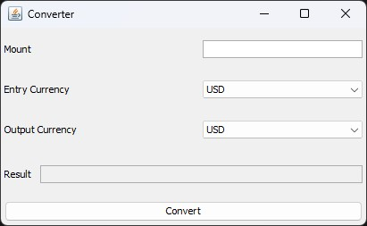
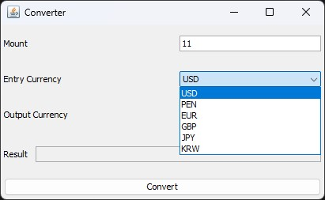
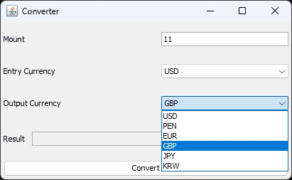
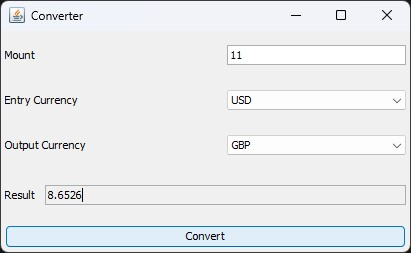

<h1 align="center"> Challenge Oracle One - Conversor de moneda </h1>

Proyecto para el segundo challenge de **Oracle Next Education**.

## Características

- Fácil de usar
- Realiza conversión de hasta 6 diferentes monedas
- Interfaz simple y minimalista.
- Manejo de errores básicos para evitar convertir valores alfabéticos.

## Capturas de pantalla

1. **Ventana Inicial:** Se debe escribir el monto a convertir en el campo de texto.
2. Se debe seleccionar la divisa actual de la moneda.
3. Se debe seleccionar la divisa final de la cual se desea saber el valor.
4. Se debe dar clic al botón que dice convertir para conocer el valor de la divisa final.

## Instalación

- Clona este repositorio
- ábrelo en tu editor de código o IDE preferido.
- Compilar y ejecutar.
- Puedes también descargar el archivo jar incluido en la carpeta [docs](docs/AluraConverter.jar).

